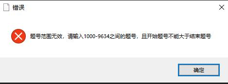
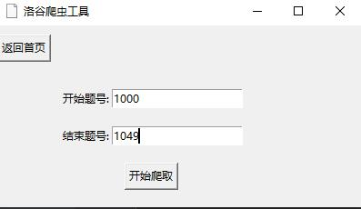
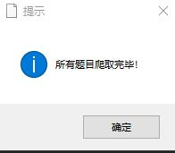
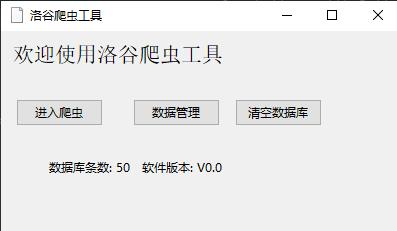

# README


|     这个作业属于哪个课程      |                     [2023秋-福州大学软件工程](https://bbs.csdn.net/forums/fzusdn-0831)                      |
|:-------------------:|:--------------------------------------------------------------------------------------------------:|
|      这个作业要求在哪里      |                      [2023秋软工实践个人作业二](https://bbs.csdn.net/topics/617213407)                       |
|       这个作业的目标       |  掌握pyhton语言，学会requests请求，tkinter GUI设计，JSON解码，~~喝美丽的汤~~BeautifulSoup使用，同时学会当前热门的copliot和ChatGPT使用  |
|         学号          |                                             112100821                                              |

### **[本项目Github代码仓库](https://github.com/Andy-boy123/python_papapa_luogu)**

## 背景
为了更好地提升代码能力，jason哥想要收集相应的题目，有针对性地刷题。而需要收集洛谷所有题目，
但是工作量太大，所以jason哥急需大家运用爬虫技术，得到洛谷各种难度的题目和题解。
考虑到近来流行的AIGC技术，jason哥认为，在AI的帮助下，这项工作的难度会大大降低。

## 项目要求
在AIGC技术的帮助下，利用Copilot等工具，运用Python完成爬虫，
并用Tkinter库制作相应的GUI页面，将爬取到的题目以markdown文件存储，
放到相应文件夹下。

### 前端页面要求
页面上需要显示相应的输入框以便筛选相应的题目。

筛选条件如上，包含题目难度，包括**暂无评定入门，普及-，普及/提高-，普及+/提高，提高+/省选-，省选/NOI-，
NOI/NOI+/CTSC**，和一些其他关键词，如**算法/来源/标题/题目编号**等。

### 爬取内容存放要求
爬下所有显示的题目：

对于每一道题，以markdown格式存储，命名为“题目编号-标题.md”，对应题目的第一篇题解，
以markdown格式存储，命名为“题目编号-标题-题解.md”，一起放入文件夹”题目编号-标题“下。

对于爬取的所有题目，将其”题目编号-标题“文件夹放到“题目难度-关键词”的目录下，若搜索时存在多个关键词，
以“关键词1-关键词2-...”展示。

### 结合AIGC
现有的AIGC应用包括VScode中的Copilot插件，Cursor IDE等等，请安装并利用这些工具辅助完成代码，要求
完成一张表格，包含以下内容：
- 爬虫任务可以被分解成哪几个小任务？
- 预估哪几个子任务可以利用AIGC？
- 实际中哪些部分利用了AIGC？
- AIGC技术的优缺点，适合用在哪些方面，不适合实现哪些功能？

#### AIGC表格
|    子任务    |     预估哪些部分使用AIGC     | 实际中哪些部分使用AIGC |
|:---------:|:--------------------:|:-------------:|
|  爬取题目内容   |  伪装heards，发送请求获取源码   |      都可以      |
|  爬取题目题解   |    获取网页源码，定位题目题解     |  需要自行根据编码解码   |
| 爬取题目标签和难度 |   获取网页源码，定位题目标签和难度   |  需要自行根据编码解码   |
|  GUI可视化   |    设置窗口大小，按键文本框逻辑    |      都可以      |
| 数据处理存储与搜索 | 设置json存储格式，进行清楚数据与保存 |      都可以      |

#### PSP表格
|           Personal Software Process Stages            | 预估耗时（分钟） | 实际耗时（分钟） |
|:-----------------------------------------------------:|:--------:|:--------:|
|                     Planning（计划）                      |    30    |    25    |
|                    Estimate（估计时间）                     |   520    |   900    |
|                    Development（开发）                    |   480    |   520    |
|                Analysis（需求分析（包括学习新技术）                 |   120    |    80    |
|                     Design（具体设计）                      |   200    |   180    |
|                     Coding（具体编码）                      |   300    |   480    |
|                Test（测试（自我测试，修改代码，提交修改）                |   280    |   320    |
| Postmortem & Process Improvement Plan（事后总结，并提出过程改进计划） |    30    |    30    |
|                       Total（合计）                       |   1960   |   2535   |

## 目录解释

- root
  - data         --------------------         存放题目和题解的文件夹
  - img          ---------------------         存放README需要的图片
  - main.py      ----------------         主程序
  - icon.ic      ------------------    GUI图表
  - README.md    
  - user_agents.txt  -------随机user_agents

    
## 前端介绍

### 工具首页


如图，有**进入爬虫**、**数据管理**、**清空数据库**三个按钮， 
页面的正下方显示当前数据库拥有的记录数和软件的版本号。


### 进入爬虫


如图，有**返回首页**、**开始爬取**两个按钮，
将开始题号和结束题号输入后点击**开始爬取**

如果输入的开始题号和结束题号非法，将提示如下，则需要返回重新输入


当我们输入正确的题号范围开始爬取后，会出现一个状态窗口如下，
展示一些当前爬取的进度


### 数据管理


如图，**数据管理**界面有**返回首页**和**搜索**两个按钮，标签将根据数据库内容进行**实时更新**，
同时还可以进行**多选**。当选取需要的筛选条件后点击**搜索**进行筛选

如果搜索成功，将在下方文本框中弹出搜索结果


如果选择的筛选条件无匹配结果，将提示如下


>关键词搜索大小写都可

### 清空数据库
当我们点击首页**清空数据库**按钮后，将出现弹窗提示确认


点击确认后将进行清空数据库操作，操作成功返回如下弹窗


>首页数据库条数在每次爬取操作和清空数据库操作后都将会更新

## 代码实现部分

### 注意事项
使用前请在[main.py](main.py)下检查开头cookie有效期，如过期请在网页手动登陆后复制cookie，
复制题解需要**登录**账号，这**非常重要！**
```python
cookie = {
    'login_referer': 'https%3A%2F%2Fwww.luogu.com.cn%2Fproblem%2FP1000',
    '_uid': '111884',
    '__client_id': '4f1bbbf98da6e49a6c98727320089c851c18d53c',
    'C3VK': 'aa6e71',
}
```

### 技术实现
#### 针对题目便签和难度的加密，我们使用如下代码进行解密
```python
headers = {
        "authority": "www.luogu.com.cn",
        "accept": "text/html,application/xhtml+xml,application/xml;q=0.9,image/avif,image/webp,image/apng,*/*;q=0.8,application/signed-exchange;v=b3;q=0.7",
        "accept-language": "zh-CN,zh;q=0.9",
        "cache-control": "max-age=0",
        "sec-ch-ua": "\"Chromium\";v=\"116\", \"Not)A;Brand\";v=\"24\", \"Google Chrome\";v=\"116\"",
        "sec-ch-ua-mobile": "?0",
        "sec-ch-ua-platform": "\"Windows\"",
        "sec-fetch-dest": "document",
        "sec-fetch-mode": "navigate",
        "sec-fetch-site": "none",
        "sec-fetch-user": "?1",
        "upgrade-insecure-requests": "1",
        "user-agent": "Mozilla/5.0 (Windows NT 10.0; Win64; x64) AppleWebKit/537.36 (KHTML, like Gecko) Chrome/116.0.0.0 Safari/537.36",
        "Cookie": "__client_id=a0306231cd05f9a814ca1bdf95c050400268bedf; _uid=0",
    }
    tag_url = 'https://www.luogu.com.cn/_lfe/tags'
    tag_html = requests.get(url=tag_url, headers=headers).json()
    tags_dicts = []
    tags_tag = list(jsonpath.jsonpath(tag_html, '$.tags')[0])
    for tag in tags_tag:
        if jsonpath.jsonpath(tag, '$.type')[0] != 1 or jsonpath.jsonpath(tag, '$.type')[0] != 4 or \
                jsonpath.jsonpath(tag, '$.type')[0] != 3:
            tags_dicts.append({'id': jsonpath.jsonpath(tag, '$.id')[0], 'name': jsonpath.jsonpath(tag, '$.name')[0]})

    arr = ['暂无评定', '入门', '普及−', '普及/提高−', '普及+/提高', '提高+/省选−', '省选/NOI−', 'NOI/NOI+/CTSC']
    ts = []
    # //是整除符号
    a = (anum - 1000) // 50 + 1
    b = (bnum - 1000) // 50 + 1

    for page in range(a, b + 1):
        # page = 1
        url = f'https://www.luogu.com.cn/problem/list?page={page}'
        html = requests.get(url=url, headers=headers).text
        urlParse = re.findall('decodeURIComponent\((.*?)\)\)', html)[0]
        htmlParse = json.loads(urllib.parse.unquote(urlParse)[1:-1])
        result = list(jsonpath.jsonpath(htmlParse, '$.currentData.problems.result')[0])

        for res in result:
            pid = jsonpath.jsonpath(res, '$.pid')[0]

            # 定义ppid,将pid中的P去掉
            ppid = pid[1:]

            # 当pid小于anum时，跳过本次循环
            if int(ppid) < anum:
                continue

            # 当pid大于bnum时，跳出循环
            if int(ppid) > bnum:
                break

            title = jsonpath.jsonpath(res, '$.title')[0]
            difficulty = arr[int(jsonpath.jsonpath(res, '$.difficulty')[0])]
            tags_s = list(jsonpath.jsonpath(res, '$.tags')[0])
            tags = []
            for ta in tags_s:
                for tags_dict in tags_dicts:
                    if tags_dict.get('id') == ta:
                        tags.append(tags_dict.get('name'))
            wen = {
                "题号": pid,
                "题目": title,
                "标签": tags,
                "难度": difficulty
            }
            ts.append(wen)
        # 显示第几页已经保存
        print(f'第{page}页已经保存')
        text_output.insert(tk.END, f'第{page}页已经保存\n')
        text_output.see(tk.END)
        # 将数据写入JSON文件
        with open('info.json', 'w', encoding='utf-8') as f:
            json.dump(ts, f, ensure_ascii=False, indent=4)
```
### 针对网站的反爬机制做出如下应对
在每次请求后随机休眠时间，避免连续请求触发网站反爬机制
```python
# 为了防止被封IP，每爬取一个题目就随机休眠一段时间
time.sleep(random.randint(1, 3))
```
在每次请求时都从user_agents中随机选择一条作为headers传入
```python
# 从user_agents.txt里随机选择一行，作为本次请求的User-Agent
        with open('user_agents.txt', 'r') as f:
            lines = f.readlines()
            custom_user_agent = random.choice(lines).strip()
        # 设置请求头
        headers = {
            'User-Agent': custom_user_agent,
        }
```
### 针对网站源码我们使用切片方法和标签定位方法获取自己需要的内容
```python
bs = BeautifulSoup(html, "html.parser")

    # 当网页中没有article标签时，重试
    core = bs.select("article")[0]
    while not core:
        print("正在重试...")
        text_output.insert(tk.END, "正在重试...\n")
        text_output.see(tk.END)
        core = bs.select("article")[0]

    md = str(core)
    md = re.sub("<h1>", "# ", md)
    md = re.sub("<h2>", "## ", md)
    md = re.sub("<h3>", "#### ", md)
    md = re.sub("</?[a-zA-Z]+[^<>]*>", "", md)
    return md
```
### 针对搜索部分，我们采用正则表达式关键词遍历进行搜索，同时将输入全部转换为小写
```python
global difficulty_var, source_options, keyword_entry, result_text, source_vars, source_listbox

    # 从 info.json 文件中读取题目数据
    def load_problem_data():
        try:
            with open('info.json', 'r', encoding='utf-8') as f:
                data = json.load(f)
                return data
        except FileNotFoundError:
            return []

    # 在你的代码中调用这个函数来加载题目数据
    题目数据 = load_problem_data()

    # 获取用户选择的标签选项
    selected_tags_indices = source_listbox.curselection()
    selected_tags = [source_options[i] for i in selected_tags_indices]

    # 获取用户选择的难度、标签和关键词
    selected_difficulty = difficulty_var.get()
    keyword = keyword_entry.get().lower()  # 转换为小写，方便不区分大小写搜索

    # 清空之前的搜索结果
    result_text.delete(1.0, tk.END)

    # 初始化一个变量，用于检测是否找到了匹配的题目
    found = False

    # 遍历题目数据，根据用户选择和关键词进行筛选
    for 题目 in 题目数据:
        难度匹配 = selected_difficulty == "所有难度" or selected_difficulty == 题目["难度"]
        标签匹配 = not selected_tags or any(tag in selected_tags for tag in 题目["标签"])
        关键词匹配 = not keyword or keyword in 题目["题目"].lower() or any(
            keyword in tag.lower() for tag in 题目["标签"])

        # 如果所有条件匹配，将题目信息添加到结果中
        if 难度匹配 and 标签匹配 and 关键词匹配:
            result_text.insert(tk.END,
                               f"题号：{题目['题号']}\n题目：{题目['题目']}\n难度：{题目['难度']}\n标签：{', '.join(题目['标签'])}\n\n")
            found = True  # 找到匹配的题目

    # 如果未找到内容，弹出提示框，并将所有选择清空
    if not found:
        messagebox.showinfo("未找到", "未找到匹配的题目。")
        # 清空选择
        difficulty_var.set("所有难度")
        source_listbox.selection_clear(0, tk.END)  # 清除标签多选框的选择
        keyword_entry.delete(0, tk.END)  # 清空关键词搜索框
```
## 测试验证
>根据要求爬取1000-1049前50题的内容









## 总结

整体代码结构风格还是比较乱，没有比较好的封装。前期的需求没有分析好，边code边补充需求，导致一直在调整添加模块，然后反复debug，
花费了大量时间。希望以后可以先做好需求分析和模块设计再动手，避免浪费时间，同时更系统完善地做好代码的封装和调测。